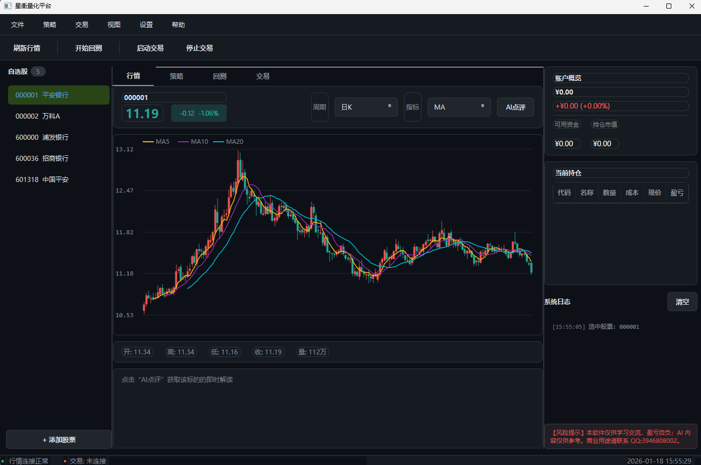
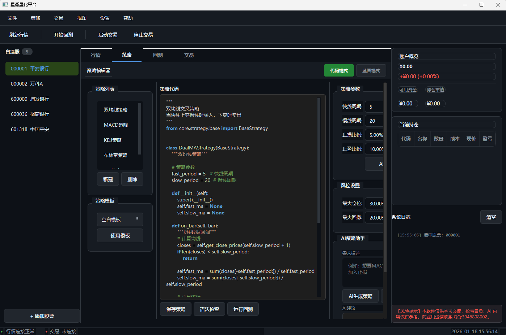
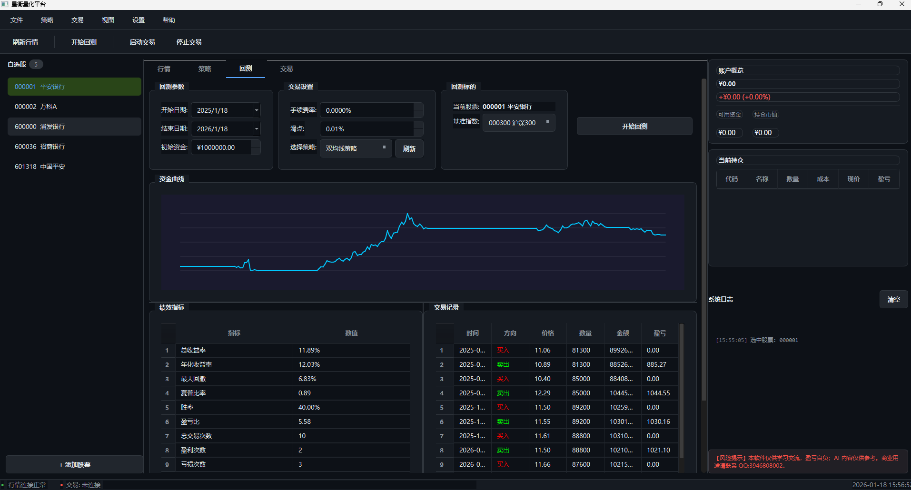
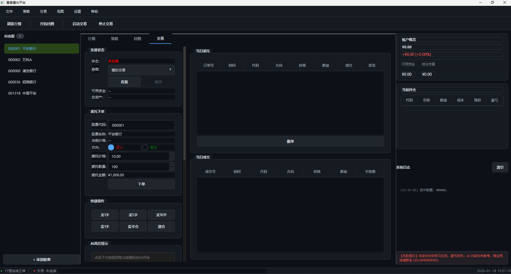

# 星衡量化平台（AstraQuant Platform）

星衡量化平台是一款面向单人本地实战的量化交易桌面应用，集行情、策略研发、回测、实盘/模拟交易、AI 助手以及多源数据访问于一体。应用内置 T+1 风控、半自动交易提示、蓝图策略编辑器、代理池与自动依赖安装能力，可通过 PyInstaller 快速打包交付。

## 主要特性

- **多源行情**：AkShare / TuShare / CSV / 多 HTTP 数据源 / 模拟行情自动切换，缺失依赖时自动安装。
- **策略研发**：代码编辑、蓝图模式、模板库与 AI 助手协同，支持多策略并行运行。
- **回测引擎**：资金曲线、绩效指标、AI 回测点评、鼠标十字准星等可视化能力一站式呈现。
- **实盘/模拟交易**：自动、半自动与手动委托共存，内建 T+1 管控、风险日志与提醒机制。
- **多股票绑定**：左侧自选股与行情、策略、回测、交易页联动，每只股票拥有独立策略与交易上下文。
- **AI 深度集成**：支持阿里百炼、腾讯混元、DeepSeek、Kimi、Kimi 等国产模型，可扩展自定义 API。
- **代理池与网络弹性**：自动安装 AkShare/TuShare，支持代理池与网络降级策略，保障高频拉取不断线。
- **打包交付**：提供 `build.spec`，一键生成单文件 `星衡量化平台.exe`，便于复制分发。

## 界面预览

| 行情总览 | 策略研发 |
| --- | --- |
|  |  |

| 回测分析 | 交易执行 |
| --- | --- |
|  |  |

## 免责声明（务必阅读）

- 本软件仅供学习与个人研究使用，作者不是持牌金融从业人员。
- 使用本软件进行的任何交易、投资或模拟，盈亏完全由使用者自行承担。
- AI 模块生成的所有内容仅供参考，不构成投资建议。
- 默认许可证仅授权学习和个人非商业用途，如需商业 / 再分发 / 售卖，须事先获得作者书面许可并签署双重授权协议。
- 商业授权及技术合作请联系：**QQ 3946808002**。

启动程序时会弹出免责声明，必须勾选同意方可进入主界面；右侧面板也会持续展示风险提示。

## 下载与运行

0. **直接下载 EXE**：[`星衡量化平台.exe`](https://github.com/lilizero123/AstraQuant-Platform/raw/main/release/%E6%98%9F%E8%A1%A1%E9%87%8F%E5%8C%96%E5%B9%B3%E5%8F%B0_v1.0/%E6%98%9F%E8%A1%A1%E9%87%8F%E5%8C%96%E5%B9%B3%E5%8F%B0.exe)（点击立即下载，可直接运行），备用 zip 包可从 [`release/星衡量化平台_v1.0.zip`](https://github.com/lilizero123/AstraQuant-Platform/raw/main/release/%E6%98%9F%E8%A1%A1%E9%87%8F%E5%8C%96%E5%B9%B3%E5%8F%B0_v1.0.zip) 获取。
1. **一键打包**：直接解压 `release/星衡量化平台_v1.0.zip`，其中包含 `星衡量化平台.exe`、README 与 LICENSE。  
2. **运行步骤**：双击 `星衡量化平台.exe` → 首次启动根据提示勾选免责声明 → 在左侧选择股票即可联动策略、回测与交易。  
3. **数据目录**：程序将自动在解压目录下生成 `config/data/logs/strategies` 等文件夹，便于保存个性化配置与策略脚本。

## 快速开始（源码运行）

```bash
pip install -r requirements.txt
python main.py
```

运行后先在左侧自选股选择股票，右侧即展示专属策略/交易配置。需要自动策略时，请在“交易”页为每只股票绑定策略，再点击“启动策略”。

## 开发 & 测试

```bash
python -m pytest tests/test_strategy.py tests/test_backtest.py tests/test_trader.py
```

### 构建可执行文件

```bash
python -m PyInstaller build.spec
# 生成 dist/星衡量化平台.exe，即为单文件发布包
```

## License & 商用说明

- 源码默认以 **MIT License** 授予 *学习与个人研究* 使用权。
- **禁止** 未经书面授权的商业使用、再分发、售卖或任何营利性行为。
- 需要商业授权（包括定制、集成、二次销售、SaaS 部署等）请联系 QQ 3946808002 商议 Dual License。

## 联系方式

- QQ：**3946808002**
- 邮箱：目前请通过 QQ 咨询获取。
- 反馈：可在 README 中说明或通过 QQ 直接联系。

> 再次提醒：本软件及 AI 模块输出仅供技术研究参考，不构成投资建议，盈亏自负。作者仅提供软件开发能力，不承担任何财务或法律责任。
